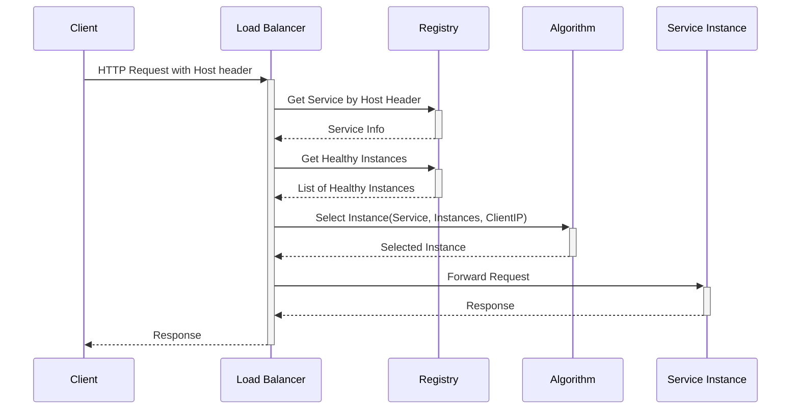
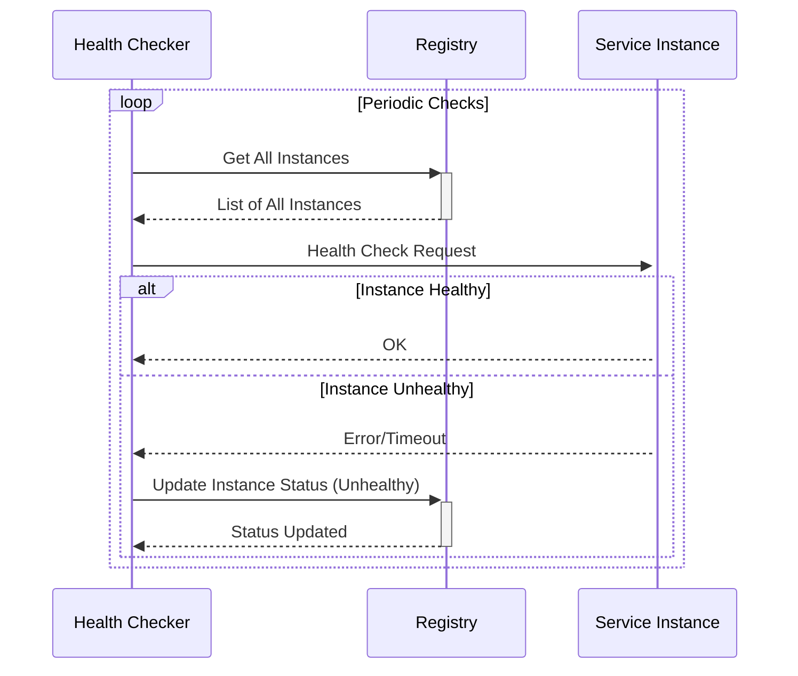

# simple-load-balancer

# Project Goal and System Design

The primary goal is to design and implement a functional load balancer with Python that embodies core distributed systems concepts and supports the following features:

1. L7 Load Balancer: support HTTP protocol
2. Support Multiple Services: provide APIs (using Flask) for service registration, and route traffic based on the Host header from client requests
3. Service Discovery: use a service registry (backed by mongodb) to keep track of server instances of different services
4. Different Load Balancing Algorithms: implement static (round robin, IP hash) and dynamic (least connection) load balancing algorithms
5. Sticky Sessions: an option to ensure that requests from the same client are directed to the same server to maintain session state
6. Health Check and Failover: reroute traffic in case of server failure
7. Optional: Logging & Monitoring (Prometheus & Grafana)
8. One single configuration file for the project
9. Simple, one-file client (load-generator) and HTTP server (duplicated instances) for demoing the load balancer, config of these use a hard-coded variable instead of config file for simplicity

# Service Registry

Load balancer provides Service Registry Restful APIs via Flask to manage services and their instances.

APIs are served on a dedicated port

## Service Management

call this api to manage the services

- id (unique, auto generated by db)
- service name (unique)
- service header (unique)
- algorithm (round robin, ip hash, least connection)
- statefulness (if true → sticky session)

## Instance Management

when a new service instance is created/deleted, call this api to update the instance list

- id (auto generated by db)
- service id
- addr (unique, could be ip:port or domain name)
- status (or we can just delete the entry)

# Load Balancer Sequence Diagram



# Health Check Sequence Diagram



# Getting Started

Follow these steps to set up and run the load balancer and demo applications.

## Prerequisites

- Python 3.x
- pip (Python package installer)
- MongoDB instance (running locally or accessible remotely)

## Setup

1.  **Clone the repository:**
    ```bash
    git clone <your-repository-url>
    cd simple-load-balancer
    ```

2.  **Install dependencies:**
    ```bash
    pip install -r requirements.txt
    ```

3.  **Configure MongoDB:**
    Update the `mongodb` section in `config.yaml` (or `config-dev.yaml` if you use that) with your MongoDB connection details.

## Running the Load Balancer

The main script starts both the load balancer proxy and the service registry API.

```bash
python src/main.py --config config.yaml
```

- The load balancer will typically run on `http://localhost:8080`.
- The service registry API will typically run on `http://localhost:8081`.
- Check `config.yaml` for the exact ports.

## Running the Demo Server

You can run multiple instances of the demo HTTP server on different ports. Each instance will register itself with the load balancer's service registry.

Open separate terminals for each instance you want to run.

**Example: Run two instances**

*   **Terminal 1:**
    ```bash
    python demo/simple_http_server.py --port 28001 --weight 2
    ```
*   **Terminal 2:**
    ```bash
    python demo/simple_http_server.py --port 28002 --weight 1
    ```

These servers will register under the service named "demo-service" (hardcoded in `simple_http_server.py`).

## Running the Load Generator

The load generator sends requests to the load balancer, which then distributes them to the registered demo server instances.

```bash
python demo/load_generator.py --url http://localhost:8080 --host demo-service --requests 100 --concurrency 10
```

**Common Options:**

-   `--url`: The address of the load balancer (default: `http://localhost:8080`).
-   `--host`: The `Host` header value to send, used by the load balancer to identify the target service (default: `demo-service`).
-   `--requests`: Total number of requests to send (default: 100000).
-   `--concurrency`: Number of concurrent clients sending requests (default: 10).
-   `--random-ip`: Simulate requests from different client IPs using the `X-Forwarded-For` header (useful for testing IP Hash).
-   `--fixed-ips N`: Simulate requests from a fixed pool of N client IPs.
-   `--interval S`: Add a delay (in seconds) between requests per worker.

